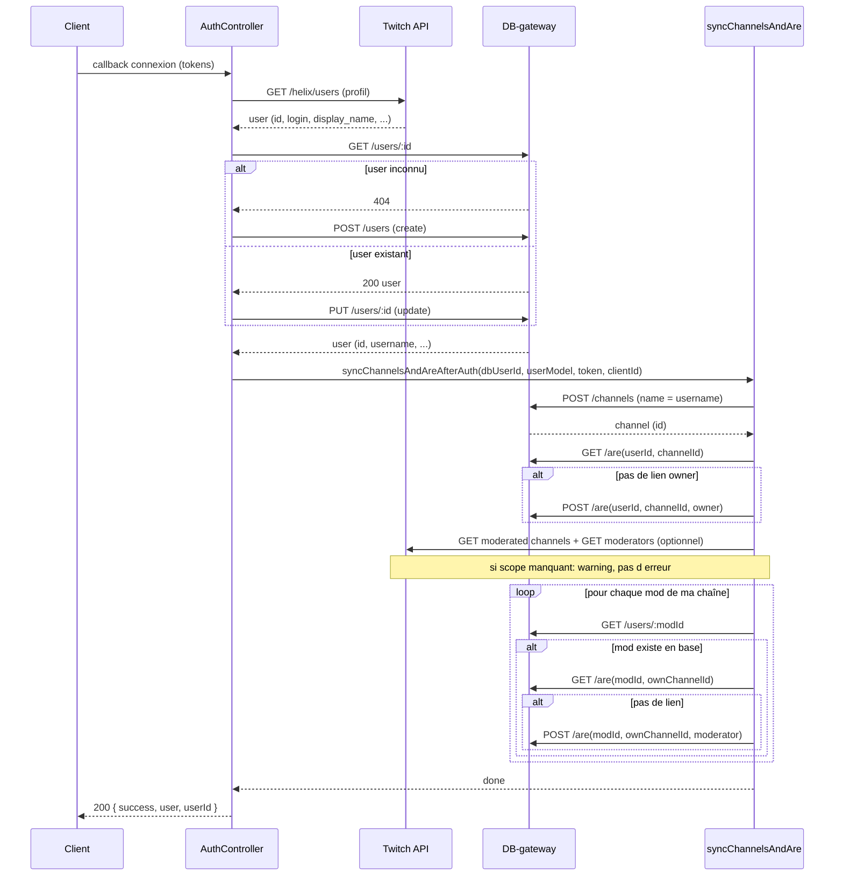
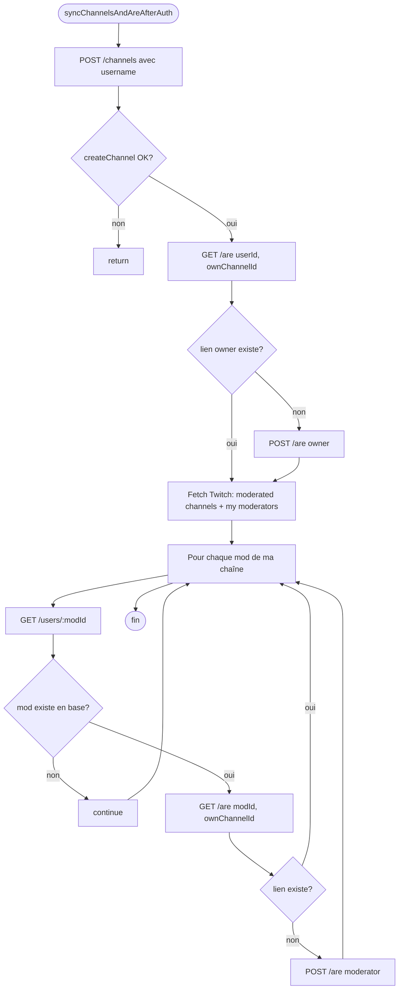

# Logique de synchronisation : Users, Channels et ARE

Ce document décrit le flux d’authentification et la synchronisation des utilisateurs, des chaînes et des liaisons ARE (User ↔ Channel avec rôle) après une connexion Twitch.

---

## Vue d’ensemble

À chaque connexion Twitch réussie, l’app :

1. **Met à jour l’utilisateur** en base (GET puis create ou update).
2. **Lance la sync** : création de la chaîne “owner”, lien ARE owner, puis mise à jour des liens modérateurs (uniquement pour les users/chaînes déjà présents en base).

Les endpoints manquants pour une sync complète sont listés dans [MISSING_ENDPOINTS.md](./MISSING_ENDPOINTS.md).

---

## Diagramme : flux complet

---

## Diagramme : décisions dans la sync

---

## Détail de la logique

### 1. Connexion et user en base

- Le **callback d’auth** reçoit les tokens Twitch et récupère le profil via `GET /helix/users`.
- L’app appelle **GET /users/:id** (id Twitch). Si 404 → **POST /users** (création), sinon **PUT /users/:id** (mise à jour).
- La réponse 200 est renvoyée au client même si la sync channels/ARE échoue (l’auth est considérée réussie).

### 2. Sync : chaîne “owner” et lien owner

- On crée une **chaîne** en DB avec le nom = username du user connecté : **POST /channels**.
- Si la création échoue (ex. nom déjà pris), on log un warning et on **arrête la sync** (pas de lien owner ni de mods).
- Sinon on fait **GET /are(userId, ownChannelId)**. Si aucun lien → **POST /are(userId, ownChannelId, "owner")**.

Ainsi, le user connecté est lié à “sa” chaîne avec le rôle `owner`.

### 3. Données Twitch (modéré / modérateurs)

- **getModeratedChannels** : chaînes où le user connecté est modérateur (scope `user:read:moderated_channels`).
- **getModerators** : liste des modérateurs de la chaîne du user (scope `moderation:read`).

En cas d’erreur (scope, token, etc.), on log un warning et on continue sans ces données (pas d’ARE pour les chaînes modérées ni pour les mods non trouvés).

### 4. ARE pour les chaînes où je suis mod

- On **n’ajoute aucune liaison** pour l’instant : on ne crée pas de channel en base pour ces chaînes.
- Une liaison ne sera ajoutée que lorsqu’un endpoint **GET channel par name** (ou équivalent) existera, pour ne lier que les chaînes **déjà présentes** en base (voir [MISSING_ENDPOINTS.md](./MISSING_ENDPOINTS.md)).

### 5. ARE pour les modérateurs de ma chaîne

- Pour **chaque** mod retourné par Twitch, on fait **GET /users/:modId**.
- **Si le mod n’existe pas en base** : on ne fait rien (pas de création de user, pas d’ARE). On évite ainsi de créer des users ou de lier des gens qui ne se sont jamais connectés.
- **Si le mod existe** : **GET /are(modId, ownChannelId)**. Si aucun lien → **POST /are(modId, ownChannelId, "moderator")**.

Seuls les users **déjà en base** sont reliés à ta chaîne avec le rôle `moderator`.

---

## Résumé des règles

| Cas | Action |
|-----|--------|
| User connecté | GET user → create ou update → sync channels/ARE |
| Chaîne “owner” | POST channel (username) puis, si besoin, POST are(owner) |
| Chaînes où je suis mod | Aucune création de channel ni d’ARE (en attente GET channel par name) |
| Modérateur de ma chaîne | ARE créée **uniquement si** le mod existe déjà en base (GET user) |
